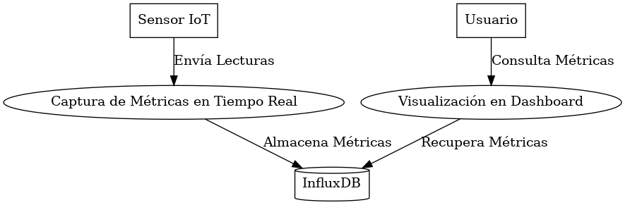
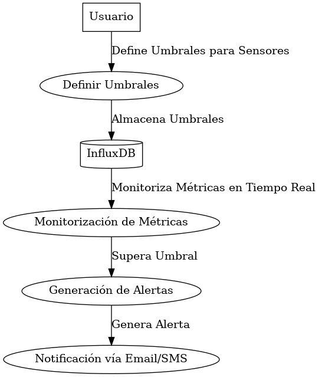

### **Informe de Casos de Uso - Proyecto IoT con MongoDB Atlas e InfluxDB**

#### **1. Introducción**

El sistema IoT para la gestión de sensores y actuadores ha sido diseñado para optimizar la captura de datos, almacenamiento, visualización y automatización de dispositivos. Se han incorporado **MongoDB Atlas** para manejar datos no estructurados y **InfluxDB** para gestionar series temporales. Los siguientes **casos de uso** describen las principales funcionalidades del sistema, junto con las nuevas adiciones y mejoras en la seguridad y la gestión de dispositivos.

---

#### **2. Casos de Uso**

##### **2.1. Caso de Uso 1: Gestión de Sensores IoT**

**Descripción:**  
El sistema permite gestionar los sensores IoT, incluyendo el registro, actualización y configuración de sensores en **MongoDB Atlas**.

**Flujo Principal:**

1. El administrador accede a la interfaz de gestión.
2. El sistema lista todos los sensores registrados consultando **MongoDB Atlas**.
3. El administrador puede agregar, modificar o eliminar sensores.
4. Las configuraciones se almacenan en **MongoDB Atlas**.

**Actores**:
  - Administrador (Admin)
**Casos de uso**:
  - Gestionar sensores (agregar, modificar, eliminar)

![[casosdeuso]](../../../assets/img/schemas/Use_Case_1_Gestion_Sensores.png)

---

##### **2.2. Caso de Uso 2: Captura de Métricas en Tiempo Real y Almacenamiento**

**Descripción:**  
El sistema captura datos de los sensores en tiempo real, almacenando las métricas en **InfluxDB** para análisis.

**Flujo Principal:**

1. Los sensores envían lecturas al sistema.
2. Las lecturas se almacenan en **InfluxDB**.
3. El usuario puede visualizar las métricas en el dashboard y configurar alertas basadas en umbrales.

**Actores**:
  - Sensores (dispositivo)
  - Usuario
**Casos de uso**:
  - Captura de métricas de sensores
  - Almacenamiento de datos en InfluxDB
  - Visualización de métricas en el dashboard

---

##### **2.3. Caso de Uso 3: Generación de Alertas Basadas en Umbrales** - (Para el TFG)

**Descripción:**  
El sistema genera alertas cuando se superan los umbrales predefinidos para las métricas de los sensores.

**Flujo Principal:**

1. El usuario define umbrales para los sensores (ej. temperatura, humedad).
2. El sistema monitoriza las métricas en **InfluxDB**.
3. Si se supera un umbral, se genera una alerta que se envía al usuario vía email/SMS.

**Actores**:
  - Usuario

**Casos de uso**:
  - Definir umbrales de sensores
  - Generar alertas basadas en umbrales
  - Envío de alertas vía email/SMS

---

##### **2.4. Caso de Uso 4: Control de Actuadores IoT** - (Para TFG)

**Descripción:**  
Permite controlar dispositivos conectados como actuadores, permitiendo encender, apagar o ajustar su funcionamiento de manera remota.

**Flujo Principal:**

1. El usuario accede al sistema.
2. Elige un actuador (ej. luces) desde la interfaz de control.
3. Envía comandos (encender/apagar, ajustar intensidad).
4. Los cambios se reflejan en tiempo real.

**Actores**:
  - Usuario

**Casos de uso**:
  - Controlar dispositivos IoT (encender/apagar, ajustar intensidad)

![[Use_Case_4_Control_Actuadores.png]](../../../assets/img/schemas/Use_Case_4_Control_Actuadores.png)

---

##### **2.5. Caso de Uso 5: Gestión de Usuarios y Autenticación**

**Descripción:**  
Permite gestionar usuarios del sistema, incluyendo autenticación y permisos.

**Flujo Principal:**

1. El administrador crea o modifica usuarios.
2. Los usuarios deben autenticarse para acceder a las funcionalidades del sistema (login, token de acceso).
3. Se definen permisos para limitar el acceso a funcionalidades específicas.
4. Los datos de usuarios y sus permisos se almacenan en **MongoDB Atlas**.

**Actores**:
  - Administrador
  - Usuario

**Casos de uso**:
  - Gestionar usuarios (crear, modificar)

> Gestion de usuarios - Autenticación
![[Use_Case_5_Gestion_Usuarios.png]](../../../assets/img/schemas/Use_Case_5_Gestion_Usuarios.png)

---

##### **2.6. Caso de Uso 6: Autenticación y Seguridad (Iniciar Sesión)**

**Descripción:**  
El sistema asegura que solo usuarios autorizados puedan acceder a la interfaz mediante autenticación con credenciales.

**Flujo Principal:**

1. El usuario introduce sus credenciales (usuario/contraseña).
2. El sistema verifica las credenciales en **MongoDB Atlas**.
3. Si son correctas, se genera un token de acceso.
4. Si las credenciales son incorrectas, el sistema muestra un mensaje de error.

**Actores**:
  - Administrador
  - Usuario

**Casos de uso**:
  - Gestionar usuarios (crear, modificar)
  - Autenticación de usuarios
  - Asignar permisos

> Autenticación de seguridad
![[Use_Case_6_Autenticacion_Seguridad.png]](../../../assets/img/schemas/Use_Case_6_Autenticacion_Seguridad.png)

---

##### **2.7. Caso de Uso 7: Recuperación de Contraseña** - (Para TFG)

**Descripción:**  
Permite a los usuarios recuperar su contraseña en caso de pérdida.

**Flujo Principal:**

1. El usuario solicita la recuperación de contraseña.
2. El sistema verifica si el email proporcionado existe en **MongoDB Atlas**.
3. Si es correcto, se envía un enlace para restablecer la contraseña.
4. Si no es correcto, se notifica al usuario.

**Actores**:
  - Administrador
  - Usuario

**Casos de uso**:
  - Asignar permisos

> Recuperación de contraseña
![[Use_Case_7_Recuperacion_Contraseña.png]](../../../assets/img/schemas/Use_Case_7_Recuperacion_Contraseña.png)

---

##### **2.8. Caso de Uso 8: Cifrado de Datos** - (Para TFG)

**Descripción:**  
Protege los datos sensibles en tránsito y en reposo, utilizando técnicas de cifrado para garantizar la seguridad.

**Flujo Principal:**

1. Los datos enviados entre dispositivos y el sistema son cifrados (ej. TLS).
2. Los datos almacenados en **MongoDB Atlas** y **InfluxDB** también están cifrados.
3. Los usuarios acceden a los datos mediante conexiones seguras.

**Actores**:
  - Sistema

**Casos de uso**:
  - Cifrado de datos en tránsito
  - Cifrado de datos en reposo
  - Conexiones seguras

![[Use_Case_8_Cifrado_Datos.png]](../../../assets/img/schemas/Use_Case_8_Cifrado_Datos.png)

---

#### **3. Resumen de los diagramas representados**

Este informe refleja los casos de uso del sistema, incluyendo las funcionalidades de **gestión de sensores y actuadores**, visualización de métricas, **generación de alertas**, y **seguridad mediante autenticación** y **cifrado de datos**. Las recientes modificaciones incorporando **MongoDB Atlas** e **InfluxDB** permiten optimizar la captura, almacenamiento y análisis de datos temporales y no estructurados.

---

### **Adjuntos:**
- **Diagramas de Casos de Uso:** Se incluirán los diagramas detallados del modelado.
  
---
