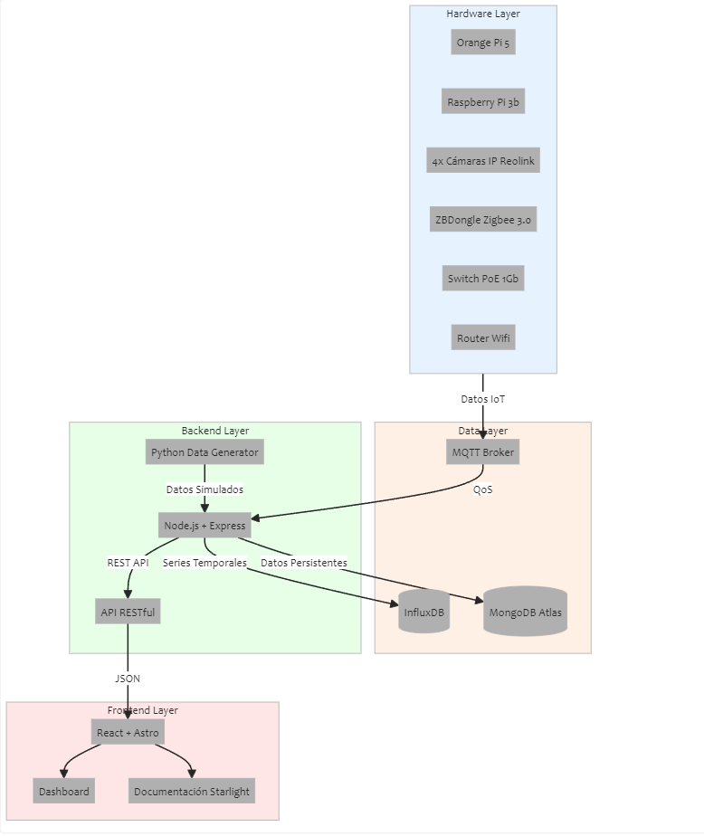

**Diagrama General del Proyecto**:

- Muestra las capas principales del sistema
- Visualiza el flujo de datos entre componentes
- Incluye todos los elementos software principales

Algunas **características** importantes representadas:

- QoS a través del broker MQTT
- Separación entre datos temporales (InfluxDB) y persistentes (MongoDB)
- Flujo de datos desde los sensores hasta el frontend
- Arquitectura de red con Switch PoE y Router Wifi