**Infraestructura del Living Lab**:

- Representa la disposición física de los dispositivos
- Muestra las conexiones de red
- Ilustra la separación entre servicios locales y cloud

```mermaid
flowchart TB
    subgraph LivingLab["Living Lab Physical Space"]
        direction TB
        subgraph Network["Red Local"]
            RT[Router Wifi\n2.4/5GHz]
            SW[Switch PoE]
        end

        subgraph Devices["Dispositivos"]
            OP[Orange Pi 5\nServidor Principal]
            RP[Raspberry Pi 3b\nGateway IoT]
            ZB[ZBDongle\nZigbee 3.0]
        end

        subgraph Monitoring["Monitorización"]
            CAM1[Cámara IP 1]
            CAM2[Cámara IP 2]
            CAM3[Cámara IP 3]
            CAM4[Cámara IP 4]
        end
    end

    subgraph Cloud["Servicios Cloud"]
        MONGO[(MongoDB Atlas)]
    end

    subgraph Local["Servicios Locales"]
        INF[(InfluxDB)]
        MQTT[MQTT Broker]
        API[API RESTful]
    end

    RT --- SW
    SW --- OP
    SW --- RP
    RP --- ZB
    SW --- CAM1
    SW --- CAM2
    SW --- CAM3
    SW --- CAM4
    
    OP --- API
    OP --- INF
    OP --- MQTT
    OP --- |Internet| MONGO

    style LivingLab fill:#f0f0f0
    style Cloud fill:#e6f3ff
    style Local fill:#e6ffe6
    style Network fill:#ffe6e6
    style Devices fill:#fff0e6
    style Monitoring fill:#f0e6ff
```

<a href="https://drive.google.com/file/d/1jFme_ohPFi8CPt5xTcP2COc3ZlslCK6H/view?usp=sharing" target="_blank"> 
 Ampliar imagen</a>