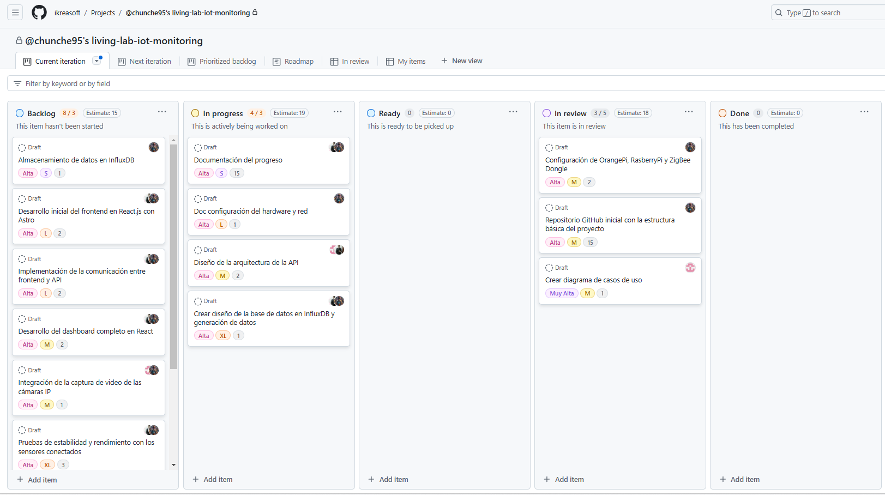

## Introducción
Para crear un plan de proyecto completo desde el 20 de octubre hasta el 1 de diciembre, con un equipo multidisciplinar de tres desarrolladores y teniendo en cuenta tanto la parte de software como hardware, te propongo usar la metodología **Scrum**. Scrum es flexible y permite manejar cambios e iteraciones rápidas, lo cual es ideal para proyectos con hardware y software. Este plan incluirá el uso de **Sprints** de dos semanas, un **Backlog del Producto**, tareas detalladas para cada desarrollador y la integración de un **Tablero Kanban** en GitHub para gestionar el flujo de trabajo.

[living-lab-iot-monitoring](https://github.com/orgs/ikreasoft/projects/4)

### **Plan del Proyecto**

#### *Duración*:
- **Inicio**: 20 de octubre
- **Fin**: 1 de diciembre
- **Duración Total**: 6 semanas
- **Sprints**: 3 Sprints de 2 semanas cada uno.

#### *Metodología*:
- **Scrum**: Ideal para iteraciones rápidas y mejora continua.
- **Equipo**: 3 desarrolladores multidisciplinarios.
- **Roles en Scrum**:
  - **Scrum Master**: Responsable de asegurar que el equipo sigue la metodología.
  - **Product Owner**: Encargado de la visión del producto y de gestionar el backlog.
  - **Development Team**: Los 3 desarrolladores, con tareas asignadas.

---

### **Backlog del Producto**

#### *Módulo de Hardware: Sensores IoT y Cámaras IP*
1. **Integración del ZBDongle Zigbee con sensores reales**:
   - Configuración y prueba de sensores conectados vía Zigbee.
   - Implementar la captura de datos en tiempo real.
   - Generar datos históricos desde los sensores (mínimo 4 horas).
   - **Tiempo estimado**: 1 Sprint.
2. **Conexión de cámaras IP (Reolink) y grabación de video**:
   - Configurar la red PoE y conectar las cámaras.
   - Implementar la captura de imágenes y video a través de la API.
   - **Tiempo estimado**: 1 Sprint.
3. **Generación de datos simulados con Python**:
   - Crear script en Python para generar al menos 15.000 datos de demostración (últimos 3 meses).
   - **Tiempo estimado**: 0,5 Sprint.

#### *Módulo de Software: Desarrollo del Dashboard*
1. **Diseño del dashboard**:
   - Prototipado de la interfaz con **React.js (Astro)**.
   - Implementación de componentes visuales para mostrar datos de sensores y cámaras.
   - **Tiempo estimado**: 1 Sprint.
2. **Desarrollo del backend**:
   - Creación de la API con **Node.js y Express**.
   - Conexión de la API con la base de datos **MongoDB Atlas** para almacenar los datos de los sensores.
   - Conexión con **InfluxDB** para el manejo de series temporales de los sensores.
   - **Tiempo estimado**: 1 Sprint.
3. **Desarrollo del firmware**:
   - Desarrollar software embebido para los dispositivos IoT que integren las señales de los sensores.
   - **Tiempo estimado**: 1 Sprint.
4. **Integración y pruebas unitarias**:
   - Asegurarse de que la captura de datos, almacenamiento y visualización funcionen de manera coordinada.
   - Pruebas unitarias para cada módulo del dashboard.
   - **Tiempo estimado**: 1 Sprint.
5. **Seguridad**:
   - Implementar seguridad en los dispositivos conectados para evitar ciberataques.
   - Configurar protocolos de autenticación.
   - **Tiempo estimado**: 0,5 Sprint.

#### *Pruebas y depuración*
1. **Pruebas unitarias y de integración**:
   - Probar cada módulo por separado y luego integrarlos.
   - **Tiempo estimado**: 0,5 Sprint.
2. **Pruebas de campo**:
   - Realizar pruebas con los dispositivos IoT y cámaras en el Living Lab.
   - **Tiempo estimado**: 1 Sprint.
   
#### *Documentación*
1. **Documentación técnica con Astro Starlight**:
   - Generar una documentación completa de todo el desarrollo usando **Astro Starlight**.
   - **Tiempo estimado**: 1 Sprint.

---

### **Cronograma del Proyecto**

| Sprint | Fecha | Objetivo Principal |
|--------|-------|--------------------|
| Sprint 1 | 20 oct - 3 nov | Configuración de hardware IoT, desarrollo del backend y generación de datos simulados. |
| Sprint 2 | 4 nov - 17 nov | Integración de cámaras IP, desarrollo del dashboard y seguridad. |
| Sprint 3 | 18 nov - 1 dic | Integración de datos reales, pruebas de campo, documentación y despliegue final. |

---

### **Desglose de las Tareas por Sprint**

#### **Sprint 1: 20 oct - 3 nov**
**Objetivo**: Configuración de sensores, generación de datos simulados y desarrollo del backend.
1. Configurar el **ZBDongle Zigbee** con sensores reales.
2. Implementar la captura de datos de sensores y cámaras.
3. Crear script en Python para generar los 15.000 datos simulados.
4. Crear las bases de datos en **MongoDB Atlas** e **InfluxDB**.
5. Desarrollar la API con **Node.js** y **Express**.
6. **Configuración de red** para cámaras IP.

#### **Sprint 2: 4 nov - 17 nov**
**Objetivo**: Integración de cámaras IP y desarrollo del dashboard.
1. Integrar la captura de video de las cámaras **Reolink** con la API.
2. Desarrollar la interfaz del dashboard usando **React.js (Astro)**.
3. Implementar visualizaciones de los datos con **InfluxDB**.
4. Añadir funciones de seguridad y autenticación a la API.
5. Pruebas unitarias de la API y dashboard.

#### **Sprint 3: 18 nov - 1 dic**
**Objetivo**: Pruebas, integración de datos reales y documentación.
1. Capturar y visualizar datos de sensores reales en el Living Lab.
2. Realizar pruebas de integración de todos los módulos.
3. Documentación del proyecto con **Astro Starlight**.
4. Pruebas de campo en el Living Lab con cámaras y sensores IoT.

---

### **Hardware y Configuración de Red**
1. **OrangePi 5**: Se usará como servidor central para gestionar la captura de datos de los sensores y cámaras.
2. **Raspberry Pi 3B**: Utilizado para realizar tareas de procesamiento local de los datos y generar datos simulados.
3. **Switch PoE y cámaras IP**: Conectar las cámaras IP para capturar video en tiempo real y almacenarlo.
4. **ZBDongle Zigbee 3.0**: Integrar sensores IoT con la red para capturar datos en tiempo real.

---

### **Tablero Kanban en GitHub**
- Crear un **tablero Kanban** en GitHub para organizar las tareas según los Sprints.
  - **Columnas**: Backlog, To Do, In Progress, Done.
  - Cada tarea se asignará a un desarrollador.
  - El equipo podrá mover las tareas entre columnas según el avance del desarrollo.

---

### **Presupuesto**
- **100 € adicionales**: Se pueden destinar para comprar sensores IoT adicionales, cables o cualquier otro dispositivo necesario para la integración.

